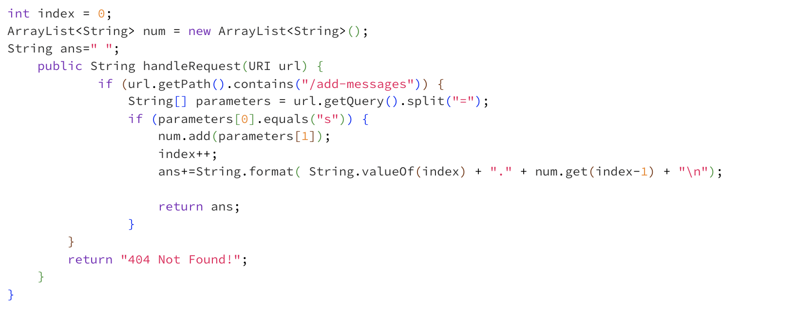
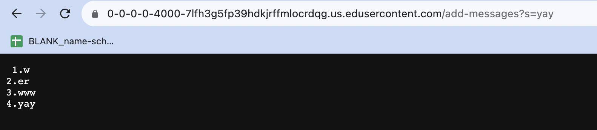
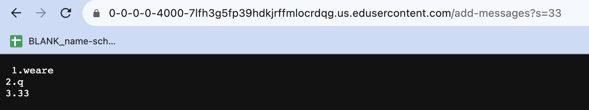
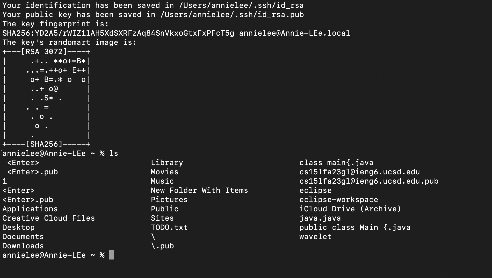
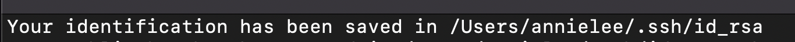
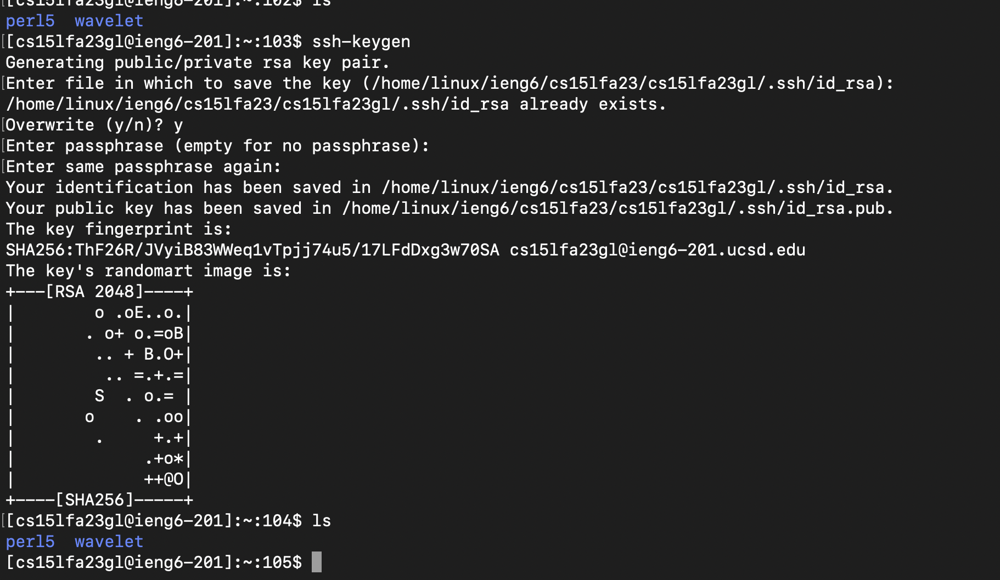
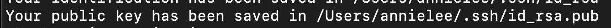

Lab Report 2

Week 3: VSCode and Your Local Machine

October,18,2023.

Part 1. 
Code for StringServer: 
Add-messages Screenshot:

1). Firstly, we would call the public static void main(String[] args) throws IOException method when we are activating the server. Then we call the method public String handleRequest(URI url) that takes in the url input and then proceeds to look for specific keywords such as "/", or "add" and then proceeds to change the output on the website.

2). In the first method, the method takes arguments of "String[]args"; which means an array of strings of Java string class, which means we can input several inputs because the array can store the inputs we put in the command line.

3.) Since we are adding onto the output every time a new input is added, instead of directly returning the input, we add an extra step where we store all the inputs as elements in a String ArrayList. We use += to " add new input TO the original" instead of replacing the previous inputs. In this case, I stored the index values in the ArrayList num, stored the index number in int index, and then finally put together the output in a String variable called ans. In the String variable ans, I combine the index number, the index-th element in the num ArrayList, and "\n" to start the next output on the next line. 

 Part 2
 1. path to the private key :  , 
 2. path to the public key: , 

 
Part 3. 
I didn't know we could do so much with terminal, and I didn't know that we could "login" to a school account or personal account on our own laptop. Furthermore, I think what fascinated me the most was the part where we focused on what different words in the URL address mean. I've always pondered what the lashes are for, or what each keyword means. Also, I think it was exciting that we explored why and how the URL is modified and what each command means. During the process, I encountered some issue with the server and I wasn't really familiar with javac and java commands, but after a few tries and getting helps from the TAs, now I fully understand the purpose of each command and how I am supposed to utilize it next time when I need to connect to a server and get a network website started.
